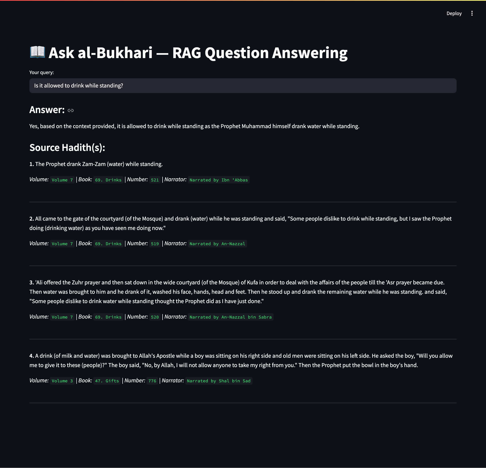

# 🕌 al-Bukhari Hadith RAG

A Retrieval-Augmented Generation (RAG) application that answers natural-language questions based on **Sahih al-Bukhari**.
Built with **LangChain**, **OpenAI embeddings**, **FAISS vector search**, and **Streamlit**.

> ⚡️ Ideal for multilingual and domain-specific retrieval tasks in Digital Humanities and Islamic NLP.

<p align="center">
  
</p>

---

## 🚀 Features

* ✅ **7,000+ normalized hadiths** from Sahih al-Bukhari
* 🔎 **Semantic search** using FAISS + OpenAI embeddings
* 📚 **Source metadata** shown: volume, book, narrator, number
* 🧠 Fully functional **Retrieval-Augmented Generation pipeline**
* ⚙️ **Reproducible index-building** pipeline from raw JSON
* 🌐 **Streamlit interface** — ask questions in natural language via browser

---

## 📚 About the Dataset: Sahih al-Bukhari

This project is based on the full content of **Sahih al-Bukhari**, one of the most authentic and respected hadith collections in Sunni Islam. Compiled by the scholar **Imam Muhammad ibn Ismail al-Bukhari** (d. 870 CE), the book contains over **7,000 hadiths**, including repetitions, and covers a wide range of topics relevant to Islamic belief, law, worship, ethics, and daily life.

The collection is organized into **93 thematic books** (*kutub*), grouped across 9 volumes. Below is the full structure:

```
Volume 1
 1. Revelation — كتاب بدء الوحي
 2. Belief — كتاب الإيمان
 3. Knowledge — كتاب العلم
 4. Ablution (Wudu') — كتاب الوضوء
 5. Bathing (Ghusl) — كتاب الغسل
 6. Menstrual Periods — كتاب الحيض
 7. Ablution with dust — كتاب التيمم
 8. Prayer (Salat) — كتاب الصلاة
 9. Prayer Hall (Sutra) — كتاب السُترَة في الصلاة
10. Times of the Prayer — كتاب مواقيت الصلاة
11. Call to Prayer — كتاب الأذان
12. Characteristics of Prayer — كتاب صفة الصلاة

Volume 2
13. Friday Prayer — كتاب الجمعة
14. Fear Prayer — كتاب صلاة الخوف
15. The Two Festivals (Eids) — كتاب العيدين
16. Witr Prayer — كتاب الوتر
17. Dua' for Rain (Istisqaa) — كتاب الاستسقاء
18. Eclipses — كتاب الكسوف
19. Prostration — كتاب سجود القرآن
20. Shortening Prayers — كتاب تقصير الصلاة
21. Night Prayer (Tahajjud) — كتاب التهجد
22. Actions while Praying — كتاب العمل في الصلاة
23. Funerals (Al-Janaa'iz) — كتاب الجنائز
24. Tax (Zakat) — كتاب الزكاة
25. Tax (Zakat ul Fitr) — كتاب صدقة الفطر
26. Pilgrimmage (Hajj) — كتاب الحج

Volume 3
27. Minor Pilgrimmage — كتاب العمرة
28. Pilgrims Prevented — كتاب المحصر
29. Pilgrims Hunting Penalty — كتاب جزاء الصيد
30. Virtues of Madinah — كتاب فضل المدينة
31. Fasting — كتاب الصوم
32. Ramadan Prayer — كتاب صلاة التراويح
33. Stay in Mosque (I'tikaf) — كتاب الاعتكاف
34. Sales and Trade — كتاب البيوع
35. Paid in Advance — كتاب السلم
36. Hiring — كتاب الإجارة
37. Debt Transfer — كتاب الحوالات
38. Business by Proxy — كتاب الوكالة
39. Agriculture — كتاب الزراعة
40. Distributing Water — كتاب المساقاة
41. Loans, Bankruptcy — كتاب في الاستقراض
42. Lost & Found — كتاب في اللقطة
43. Oppressions — كتاب المظالم
44. Partnership — كتاب الشركة
45. Mortgaging — كتاب الرهن
46. Freeing Slaves — كتاب العتق
47. Gifts — كتاب الهبة
48. Witnesses — كتاب الشهادات
49. Peacemaking — كتاب الصلح
50. Conditions — كتاب الشروط

Volume 4
51. Wills — كتاب الوصايا
52. Jihaad — كتاب الجهاد والسير
53. One-fifth of Booty — كتاب فرض الخمس
54. Beginning of Creation — كتاب بدء الخلق
55. Prophets — كتاب أحاديث الأنبياء
56. Merits of Sunnah — كتاب المناقب

Volume 5
57. The Companions — كتاب مناقب الصحابة
58. Merits of Al-Ansaar — كتاب مناقب الأنصار
59. Expeditions — كتاب المغازي

Volume 6
60. Prophetic Commentary — كتاب التفسير
61. Virtues of the Qur'an — كتاب فضائل القرآن

Volume 7
62. Marriage — كتاب النكاح
63. Divorce — كتاب الطلاق
64. Supporting Family — كتاب النفقة
65. Food, Meals — كتاب الأطعمة
66. Sacrifice on Birth — كتاب العقيقة
67. Hunting, Slaughter — كتاب الصيد والذبائح
68. Al-Adha Sacrifice — كتاب الأضاحي
69. Drinks — كتاب الأشربة
70. Patients — كتاب المرضى
71. Medicine — كتاب الطب
72. Dress — كتاب اللباس

Volume 8
73. Good Manners — كتاب الأدب
74. Asking Permission — كتاب الاستئذان
75. Invocations — كتاب الدعوات
76. Softening the Heart — كتاب الرقاق
77. Divine Will (Qadar) — كتاب القدر
78. Oaths and Vows — كتاب الأيمان والنذور
79. Unfulfilled Oaths — كتاب كفارات الأيمان
80. Inheritance Laws — كتاب الفرائض
81. Punishment Laws — كتاب الحدود
82. Disbelievers (war) — كتاب استتابة المرتدين

Volume 9
83. Blood Money — كتاب الديات
84. Dealing with Apostates — كتاب المحاربين
85. Under Duress — كتاب الإكراه
86. Tricks — كتاب الحيل
87. Interpretations of Dreams — كتاب التعبير
88. End of the World — كتاب الفتن
89. Judgments — كتاب الأحكام
90. Wishes — كتاب التمني
91. Truthful Word — كتاب التوحيد
92. Holding Steadfast — كتاب الاعتصام بالكتاب والسنة
93. Oneness of Allah — كتاب التوحيد
```

### 📥 Data Source

The base dataset was adapted from the excellent open-source repository
👉 [essaji/Complete-Sahih-Bukhari-Json](https://github.com/essaji/Complete-Sahih-Bukhari-Json)

All hadiths were normalized into a flat format, enriched with metadata (volume, book, number, narrator), and made searchable through vector indexing.

---

---

## 🧪 Example Queries and Real Responses

### ❓ **What breaks the fast during Ramadan?**

**🧠 Answer:**

> The fast during Ramadan is broken by consuming food, drink, or engaging in sexual activity during the daylight hours.

**📌 Source Hadith(s):**

1. **Narrator:** *Umar bin Al-Khattab*
   📖 *"When night falls from this side and the day vanishes from this side and the sun sets, then the fasting person should break his fast."*
   `Vol. 3 | Book 31 | No. 175`

2. **Narrator:** *Anas*
   📖 *"Do not practice Al-Wisal..." — The Prophet replied, "I am not like any of you, for I am given food and drink (by Allah) during the night."*
   `Vol. 3 | Book 31 | No. 182`

3. **Narrator:** *Ibn 'Abbas*
   📖 *"Once the Prophet set out in the month of Ramadan. He observed fasting till he reached a place called Kadid where he broke his fast."*
   `Vol. 4 | Book 52 | No. 202`

4. **Narrator:** *Abu Huraira*
   📖 *"The Fast is for Me... as he leaves his sexual desire, food and drink for My Sake."*
   `Vol. 9 | Book 93 | No. 584`

---

### 📖 What should one say before sleeping?

**Answer:**
Before sleeping, one can say the following supplication:
**"Bismika Rabbi wada'tu Janbi wa bika arfa'uhu, In amsakta nafsi farhamha wa in arsaltaha fahfazha bima tahfazu bihi ibadakas-salihin."**
Additionally:
**"Allhumma bismika ahya wa amut."**

**Source Hadith(s):**

1. *"He should say: 'Bismika Rabbi wada'tu Janbi wa bika arfa'uhu...'"*
   **Vol. 8 | Book 75 | No. 332 | Narrator:** Abu Huraira

2. *"If anyone of you feels drowsy while praying, he should sleep..."*
   **Vol. 1 | Book 4 | No. 212 | Narrator:** Anas

3. *"If anyone of you feels drowsy while praying he should go to bed..."*
   **Vol. 1 | Book 4 | No. 211 | Narrator:** Aisha

4. *"When the Prophet went to bed, he used to say: 'Allhumma bismika ahya wa amut.'..."*
   **Vol. 9 | Book 93 | No. 491 | Narrator:** Juhaifa

---

### 📖 What is the reward of night prayer?

**Answer:**
The reward of establishing prayers on the night of Qadr (Laylat al-Qadr) out of sincere faith and hoping to attain Allah's rewards is that all past sins will be forgiven.

**Source Hadith(s):**

1. *"The reward of a prayer in congregation is twenty five times greater...*"
   **Vol. 1 | Book 11 | No. 621 | Narrator:** Abu Salama bin 'Abdur Rahman

2. *"A prayer performed in congregation is twenty-five times more superior..."*
   **Vol. 6 | Book 60 | No. 241 | Narrator:** Ibn Al-Musaiyab

3. *"Whoever establishes the prayers on the night of Qadr... all his past sins will be forgiven."*
   **Vol. 1 | Book 2 | No. 34 | Narrator:** Abu Huraira

4. *"If the people knew what is the reward of making the call (for the prayer)..."*
   **Vol. 3 | Book 48 | No. 854 | Narrator:** Abu Huraira

---

📌 **All hadiths — including book numbers, hadith numbers, and narrators — match the structure of [sahih-bukhari.com](http://www.sahih-bukhari.com) and can be cross-verified there.**

---

## ▶️ Quick Start

```bash
git clone https://github.com/Quchluk/al-Bukhari-Hadith-RAG.git
cd al-Bukhari-Hadith-RAG
pip install -r requirements.txt

Configure your OpenAI API key:

cp .env.example .env
# then open .env and paste your key

Run the app:

streamlit run app.py

Open http://localhost:8501 in your browser.
```

---

🧱 Repository Structure

```
al-bukhari-rag/
├── app.py                   # Streamlit app
├── build_index.py           # Builds FAISS index from normalized JSONL
├── faiss_index/             # Optional prebuilt FAISS index (index.faiss, index.pkl)
├── Data/
│   ├── sahih_bukhari.json               # Raw data (optional)
│   └── sahih_bukhari_normalized.jsonl  # Normalized JSONL (one hadith per line)
├── preprocessing/
│   ├── normalize_hadiths.py # Script for normalizing the hadiths
│   └── README.md            # Explanation of preprocessing
├── requirements.txt
├── .env.example             # Template for environment config
├── .gitignore
├── LICENSE
└── README.md                # This file
```

---

🧠 Using the Prebuilt Index

If using the bundled FAISS index:

FAISS.load\_local(path, embeddings, allow\_dangerous\_deserialization=True)

Or you can build it yourself (see below).

---

🛠 Rebuilding the Index

```bash
python preprocessing/normalize_hadiths.py \
  --input Data/sahih_bukhari_raw.json \
  --output Data/sahih_bukhari_normalized.jsonl

python build_index.py
```

To swap out OpenAI for HuggingFace or other models, modify the embedding class in build\_index.py.

---

💡 Applications

* 🧾 Islamic Knowledge QA systems
* 🌍 Multilingual low-resource RAG pipelines
* 🏛 Digital Humanities research
* 📚 Educational bots based on classical texts
* 🧪 Experimentation with domain-specific vector search

---

📚 Data Source

Hadith data adapted from:
essaji/Complete-Sahih-Bukhari-Json

All other code, normalization, interface, and indexing steps are original.

---

🛡 License

This project is licensed under the MIT License.
See the LICENSE file for full terms.

---

👤 Author

Made by Anton Smirnov
Feel free to fork, cite, or build upon this project.
